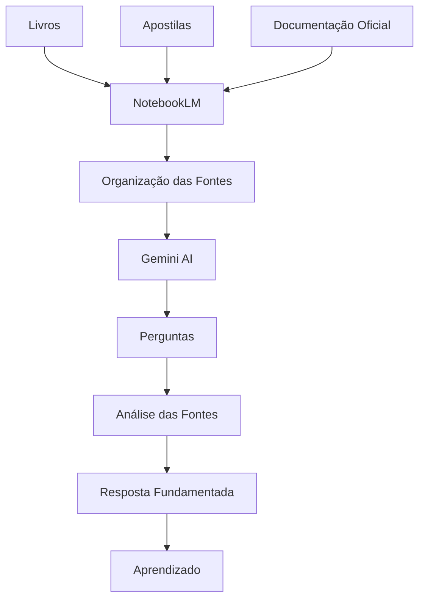

# Arquitetura

## Visão Geral

Este projeto utiliza o NotebookLM como uma base de conhecimento para auxiliar no estudo de algoritmos, lógica de programação e estruturas de dados.

O fluxo consiste em importar fontes confiáveis, organizá-las em uma única base de conhecimento e utilizar IA Generativa para consultar essas informações de forma contextualizada.

---

## Arquitetura do sistema

---

## Componentes

### Fontes

Materiais utilizados como base de conhecimento.

Exemplos:

- Livros
- Documentações oficiais
- Apostilas
- Artigos técnicos

---

### NotebookLM

Responsável por organizar todas as fontes em uma única base pesquisável.

---

### IA Generativa

Interpreta a pergunta do usuário, consulta as fontes disponíveis e produz respostas fundamentadas.

---

### Resultado

O usuário recebe:

- respostas contextualizadas;
- resumos;
- comparações;
- exercícios;
- explicações baseadas nas fontes carregadas.

---

## Benefícios

- Centralização do conhecimento.
- Aprendizagem mais rápida.
- Revisões eficientes.
- Comparação entre diferentes materiais.
- Consulta baseada em fontes.
